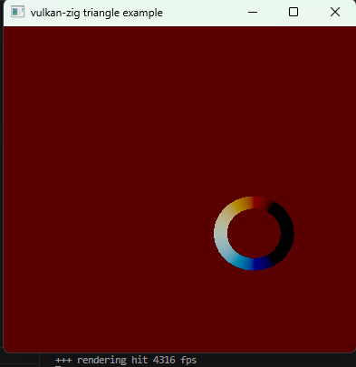

# mea_vk

next steps:
- test for problematic instance amount
- add 3d camera over data

learning vulkan in zig:

# gpu memory spaces
generic
gs
fs
ss
global
constant
param
shared
local
input
output
uniform
push_constant
storage_buffer
physical_storage_buffer
flash
flash1
flash2
flash3
flash4
flash5
cog
hub
lut